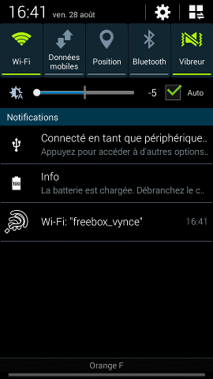
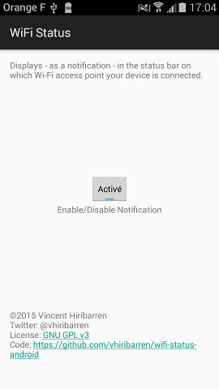

# Wifi Status for Android

This app displays in the notification bar the current Wi-Fi access point.

With modern Android (Lollipop and above version) it is not very useful since the information is
already displayed in the bar. However it can be useful for older Android version, or if you
want a quicker access to the current access point name.

 

From a developer point of view, the app also demonstrates:

- usage of wifi status receiver in the manifest file
- how to disable a receiver declared in a manifest file
- how to persist a notification
- how to not display the icon of the notification in the status bar
- no service needed to monitor and react to wifi connections change
- how to check Android API level

## Play Store

For test, easiness and courtesy, [the app is available on the Play Store](https://play.google.com/store/apps/details?id=net.alea.wifistatus).

## License and author

Wifi Status for Android - Check Wifi status in notification bar

Copyright (C) 2015 Vincent Hiribarren

This program is free software: you can redistribute it and/or modify it under the terms of the GNU
General Public License as published by the Free Software Foundation, either version 3 of the License,
or (at your option) any later version.

This program is distributed in the hope that it will be useful, but WITHOUT ANY WARRANTY; without
even the implied warranty of MERCHANTABILITY or FITNESS FOR A PARTICULAR PURPOSE. See the GNU General
Public License for more details.

You should have received a copy of the GNU General Public License along with this program. If not,
see http://www.gnu.org/licenses/.
